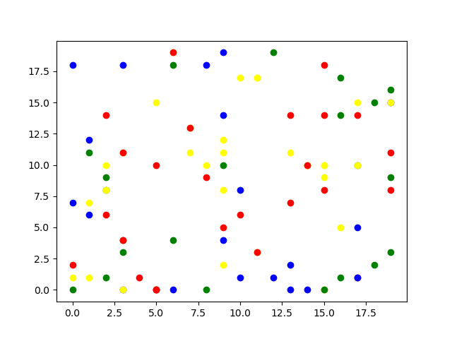
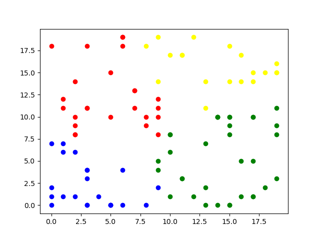

# kMeans_CUDA
K-means using CUDA, this is a parallel implementation of the classic Machine Learning algorithm Kmeans

## What was developed in this project
In this project It was created a framework that calculates the KMeans of multiple N Dimensional points 

# Before and After pictures of the system

